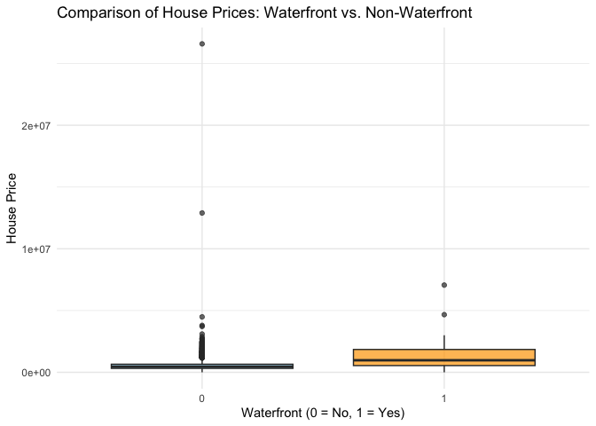
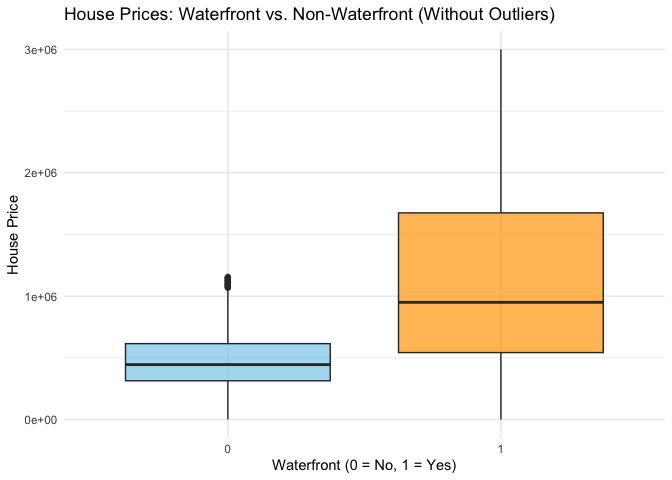

README
================

``` r
# Install required packages if not already installed
if (!require(knitr)) install.packages("knitr", dependencies = TRUE)

if (!require(curl)) install.packages("curl", dependencies = TRUE)
if (!require(utils)) install.packages("utils", dependencies = TRUE)

# Load the packages
library(curl)
library(utils)

# Define the URL from Kaggle
dataset_url <- "https://www.kaggle.com/api/v1/datasets/download/fratzcan/usa-house-prices"

# Set the output file paths
zip_file <- "./usa-house-prices.zip"
extract_dir <- "./usa-house-prices"

# Download the ZIP file
curl_download(dataset_url, zip_file)

# Create extraction directory if it doesn't exist
if (!dir.exists(extract_dir)) dir.create(extract_dir)

# Unzip the file
unzip(zip_file, exdir = extract_dir)

# List extracted files
extracted_files <- list.files(extract_dir, full.names = TRUE)
message("Download and extraction complete! Files saved at: ", extract_dir)
message("Extracted files: ", paste(extracted_files, collapse = ", "))
```

# Part 1

**When was the data collected?** The data was collected in 2014. The
time range is from 5/2/2014 to 7/10/2014. The data was uploaded to
kaggle and last updated seven months ago.

**Where was the data acquired?** The data was acquired from kaggle.com.
The data found on that website was originally on zillow.com, the real
estate website.

**How was the data acquired?** Zillow’s Economic Research Team gathers,
refines, and publishes housing and economic data from both public and
proprietary sources. The core of Zillow’s data is derived from public
property records filed with local municipalities, including deeds,
property details, parcel information, and transaction histories. Many of
the statistics in these datasets are calculated from raw property data.
The methodology behind these calculations is further explained in the
next section, where the dataset attributes are described.

**What are the attributes of this dataset?** The dataset consists of 18
attributes that describe various characteristics of properties. The
Price variable represents the sale price of the property in USD and
serves as the target variable. Property features such as Bedrooms,
Bathrooms, Sqft Living, Sqft Lot, and Floors provide insight into the
size and layout of the home. The View and Condition variables are
ordinal indices that rate the property’s visual appeal and overall
state. The Waterfront attribute is a nominal, binary indicator of
whether the property has a waterfront view. Additionally, the dataset
includes Yr Built and Yr Renovated, which record the year the property
was originally constructed and last updated. Location-based attributes,
including Street, City, State Zip, and Country, offer contextual
information on where the property is situated.

**What type of data do these attributes contain?** The dataset contains
a mix of nominal, ordinal, interval, and ratio data types. Nominal
variables include categorical data without an inherent order, such as
Street, City, State Zip, Country, and Waterfront. Ordinal variables
represent ranked attributes with meaningful order but uneven intervals,
such as View, Condition, and Date. Interval data, such as Yr Built and
Yr Renovated, have meaningful differences between values but no true
zero point. Finally, Ratio data includes numerical attributes with a
true zero, such as Price, Bedrooms, Bathrooms, Sqft Living, Sqft Lot,
Floors, Sqft Above, and Sqft Basement, allowing for meaningful
comparisons and calculations.

``` r
#import data dictionary
data_dictionary = read.csv("data_dictionary.csv")

library(knitr)
library(kableExtra)

# Create a nice table with kable and kableExtra
kable(data_dictionary, caption = "Variable Descriptions", col.names = c("Variable", "Description", "Type")) %>%
  kable_styling(bootstrap_options = c("striped", "hover", "condensed"), full_width = FALSE) %>%
  column_spec(1, bold = TRUE) %>%
  column_spec(2, italic = TRUE) %>%
  row_spec(0, background = "lightgray")  # Add a gray background to the header
```

<table class="table table-striped table-hover table-condensed" style="color: black; width: auto !important; margin-left: auto; margin-right: auto;">
<caption>
Variable Descriptions
</caption>
<thead>
<tr>
<th style="text-align:left;background-color: lightgray !important;">
Variable
</th>
<th style="text-align:left;background-color: lightgray !important;">
Description
</th>
<th style="text-align:left;background-color: lightgray !important;">
Type
</th>
</tr>
</thead>
<tbody>
<tr>
<td style="text-align:left;font-weight: bold;">
Date
</td>
<td style="text-align:left;font-style: italic;">
The date when the property was sold. This feature helps in understanding
the temporal trends in property prices.
</td>
<td style="text-align:left;">
Ordinal
</td>
</tr>
<tr>
<td style="text-align:left;font-weight: bold;">
Price
</td>
<td style="text-align:left;font-style: italic;">
The sale price of the property in USD. This is the target variable we
aim to predict.
</td>
<td style="text-align:left;">
Ratio
</td>
</tr>
<tr>
<td style="text-align:left;font-weight: bold;">
Bedrooms
</td>
<td style="text-align:left;font-style: italic;">
The number of bedrooms in the property. Generally, properties withmore
bedrooms tend to have higher prices.
</td>
<td style="text-align:left;">
Ratio
</td>
</tr>
<tr>
<td style="text-align:left;font-weight: bold;">
Bathrooms
</td>
<td style="text-align:left;font-style: italic;">
The number of bathrooms in the property. Similar to bedrooms, more
bathrooms can increase a property’s value.
</td>
<td style="text-align:left;">
Ratio
</td>
</tr>
<tr>
<td style="text-align:left;font-weight: bold;">
Sqft Living
</td>
<td style="text-align:left;font-style: italic;">
The size of the living area in square feet. Larger living areas are
typically associated with higher property values.
</td>
<td style="text-align:left;">
Ratio
</td>
</tr>
<tr>
<td style="text-align:left;font-weight: bold;">
Sqft Lot
</td>
<td style="text-align:left;font-style: italic;">
The size of the lot in square feet. Larger lots may increase a
property’s desirability and value.
</td>
<td style="text-align:left;">
Ratio
</td>
</tr>
<tr>
<td style="text-align:left;font-weight: bold;">
Floors
</td>
<td style="text-align:left;font-style: italic;">
The number of floors in the property. Properties with multiple floors
may offer more living space and appeal.
</td>
<td style="text-align:left;">
Ratio
</td>
</tr>
<tr>
<td style="text-align:left;font-weight: bold;">
Waterfront
</td>
<td style="text-align:left;font-style: italic;">
A binary indicator (1 if the property has a waterfront view, 0
other-wise). Properties with waterfront views are often valued higher.
</td>
<td style="text-align:left;">
Nominal
</td>
</tr>
<tr>
<td style="text-align:left;font-weight: bold;">
View
</td>
<td style="text-align:left;font-style: italic;">
An index from 0 to 4 indicating the quality of the property’s view.
Better views are likely to enhance a property’s value.
</td>
<td style="text-align:left;">
Ordinal
</td>
</tr>
<tr>
<td style="text-align:left;font-weight: bold;">
Condition
</td>
<td style="text-align:left;font-style: italic;">
An index from 1 to 5 rating the condition of the property. Properties in
better condition are typically worth more.
</td>
<td style="text-align:left;">
Ordinal
</td>
</tr>
<tr>
<td style="text-align:left;font-weight: bold;">
Sqft Above
</td>
<td style="text-align:left;font-style: italic;">
The square footage of the property above the basement. This can help
isolate the value contribution of above-ground space.
</td>
<td style="text-align:left;">
Ratio
</td>
</tr>
<tr>
<td style="text-align:left;font-weight: bold;">
Sqft Basement
</td>
<td style="text-align:left;font-style: italic;">
The square footage of the basement. Basements may add value depending on
their usability.
</td>
<td style="text-align:left;">
Ratio
</td>
</tr>
<tr>
<td style="text-align:left;font-weight: bold;">
Yr Built
</td>
<td style="text-align:left;font-style: italic;">
The year the property was built. Older properties may have historical
value, while newer ones may offer modern amenities.
</td>
<td style="text-align:left;">
Interval
</td>
</tr>
<tr>
<td style="text-align:left;font-weight: bold;">
Yr Renovated
</td>
<td style="text-align:left;font-style: italic;">
The year the property was last renovated. Recent renovations can
increase a property’s appeal and value.
</td>
<td style="text-align:left;">
Interval
</td>
</tr>
<tr>
<td style="text-align:left;font-weight: bold;">
Street
</td>
<td style="text-align:left;font-style: italic;">
The street address of the property. This feature can be used to analyze
location-specific price trends.
</td>
<td style="text-align:left;">
Nominal
</td>
</tr>
<tr>
<td style="text-align:left;font-weight: bold;">
City
</td>
<td style="text-align:left;font-style: italic;">
he city where the property is located. Different cities have distinct
market dynamics.
</td>
<td style="text-align:left;">
Nominal
</td>
</tr>
<tr>
<td style="text-align:left;font-weight: bold;">
Statezip
</td>
<td style="text-align:left;font-style: italic;">
The state and zip code of the property. This feature provides regional
context for the property.
</td>
<td style="text-align:left;">
Nominal
</td>
</tr>
<tr>
<td style="text-align:left;font-weight: bold;">
Country
</td>
<td style="text-align:left;font-style: italic;">
The country where the property is located. While this dataset focuses on
properties in Australia, this feature is included for completeness.
</td>
<td style="text-align:left;">
Nominal
</td>
</tr>
</tbody>
</table>

``` r
data <- read.csv("./usa-house-prices/USA Housing Dataset.csv")

head(data) 
```

    ##                  date   price bedrooms bathrooms sqft_living sqft_lot floors
    ## 1 2014-05-09 00:00:00  376000        3      2.00        1340     1384      3
    ## 2 2014-05-09 00:00:00  800000        4      3.25        3540   159430      2
    ## 3 2014-05-09 00:00:00 2238888        5      6.50        7270   130017      2
    ## 4 2014-05-09 00:00:00  324000        3      2.25         998      904      2
    ## 5 2014-05-10 00:00:00  549900        5      2.75        3060     7015      1
    ## 6 2014-05-10 00:00:00  320000        3      2.50        2130     6969      2
    ##   waterfront view condition sqft_above sqft_basement yr_built yr_renovated
    ## 1          0    0         3       1340             0     2008            0
    ## 2          0    0         3       3540             0     2007            0
    ## 3          0    0         3       6420           850     2010            0
    ## 4          0    0         3        798           200     2007            0
    ## 5          0    0         5       1600          1460     1979            0
    ## 6          0    0         3       2130             0     2003            0
    ##                       street         city statezip country
    ## 1    9245-9249 Fremont Ave N      Seattle WA 98103     USA
    ## 2           33001 NE 24th St    Carnation WA 98014     USA
    ## 3           7070 270th Pl SE     Issaquah WA 98029     USA
    ## 4             820 NW 95th St      Seattle WA 98117     USA
    ## 5          10834 31st Ave SW      Seattle WA 98146     USA
    ## 6 Cedar to Green River Trail Maple Valley WA 98038     USA

``` r
# Load necessary libraries
library(dplyr)
library(readr)
library(gt)


df <- data

# Select numeric columns
numeric_df <- df %>%
  select(where(is.numeric))

# Generate summary statistics (with NA count)
numeric_summary <- numeric_df %>%
  reframe(
    Variable = names(.),
    Count = sapply(., function(x) sum(!is.na(x))),
    Missing = sapply(., function(x) sum(is.na(x))),  # Count of NAs
    Mean = sapply(., mean, na.rm = TRUE),
    SD = sapply(., sd, na.rm = TRUE),
    Min = sapply(., min, na.rm = TRUE),
    Q1 = sapply(., quantile, 0.25, na.rm = TRUE),
    Median = sapply(., median, na.rm = TRUE),
    Q3 = sapply(., quantile, 0.75, na.rm = TRUE),
    Max = sapply(., max, na.rm = TRUE)
  )

# Create a nicely formatted table with gt
numeric_summary %>%
  gt() %>%
  tab_header(title = "Summary Statistics - Numeric Variables") %>%
  fmt_number(columns = -c(1,2,3), decimals = 2) %>%  # Format numeric values
  tab_options(
    table.border.top.color = "black",
    table.border.bottom.color = "black",
    row.striping.include_table_body = TRUE
  )
```

<div id="offouqsgzj" style="padding-left:0px;padding-right:0px;padding-top:10px;padding-bottom:10px;overflow-x:auto;overflow-y:auto;width:auto;height:auto;">
<style>#offouqsgzj table {
  font-family: system-ui, 'Segoe UI', Roboto, Helvetica, Arial, sans-serif, 'Apple Color Emoji', 'Segoe UI Emoji', 'Segoe UI Symbol', 'Noto Color Emoji';
  -webkit-font-smoothing: antialiased;
  -moz-osx-font-smoothing: grayscale;
}
&#10;#offouqsgzj thead, #offouqsgzj tbody, #offouqsgzj tfoot, #offouqsgzj tr, #offouqsgzj td, #offouqsgzj th {
  border-style: none;
}
&#10;#offouqsgzj p {
  margin: 0;
  padding: 0;
}
&#10;#offouqsgzj .gt_table {
  display: table;
  border-collapse: collapse;
  line-height: normal;
  margin-left: auto;
  margin-right: auto;
  color: #333333;
  font-size: 16px;
  font-weight: normal;
  font-style: normal;
  background-color: #FFFFFF;
  width: auto;
  border-top-style: solid;
  border-top-width: 2px;
  border-top-color: #000000;
  border-right-style: none;
  border-right-width: 2px;
  border-right-color: #D3D3D3;
  border-bottom-style: solid;
  border-bottom-width: 2px;
  border-bottom-color: #000000;
  border-left-style: none;
  border-left-width: 2px;
  border-left-color: #D3D3D3;
}
&#10;#offouqsgzj .gt_caption {
  padding-top: 4px;
  padding-bottom: 4px;
}
&#10;#offouqsgzj .gt_title {
  color: #333333;
  font-size: 125%;
  font-weight: initial;
  padding-top: 4px;
  padding-bottom: 4px;
  padding-left: 5px;
  padding-right: 5px;
  border-bottom-color: #FFFFFF;
  border-bottom-width: 0;
}
&#10;#offouqsgzj .gt_subtitle {
  color: #333333;
  font-size: 85%;
  font-weight: initial;
  padding-top: 3px;
  padding-bottom: 5px;
  padding-left: 5px;
  padding-right: 5px;
  border-top-color: #FFFFFF;
  border-top-width: 0;
}
&#10;#offouqsgzj .gt_heading {
  background-color: #FFFFFF;
  text-align: center;
  border-bottom-color: #FFFFFF;
  border-left-style: none;
  border-left-width: 1px;
  border-left-color: #D3D3D3;
  border-right-style: none;
  border-right-width: 1px;
  border-right-color: #D3D3D3;
}
&#10;#offouqsgzj .gt_bottom_border {
  border-bottom-style: solid;
  border-bottom-width: 2px;
  border-bottom-color: #D3D3D3;
}
&#10;#offouqsgzj .gt_col_headings {
  border-top-style: solid;
  border-top-width: 2px;
  border-top-color: #D3D3D3;
  border-bottom-style: solid;
  border-bottom-width: 2px;
  border-bottom-color: #D3D3D3;
  border-left-style: none;
  border-left-width: 1px;
  border-left-color: #D3D3D3;
  border-right-style: none;
  border-right-width: 1px;
  border-right-color: #D3D3D3;
}
&#10;#offouqsgzj .gt_col_heading {
  color: #333333;
  background-color: #FFFFFF;
  font-size: 100%;
  font-weight: normal;
  text-transform: inherit;
  border-left-style: none;
  border-left-width: 1px;
  border-left-color: #D3D3D3;
  border-right-style: none;
  border-right-width: 1px;
  border-right-color: #D3D3D3;
  vertical-align: bottom;
  padding-top: 5px;
  padding-bottom: 6px;
  padding-left: 5px;
  padding-right: 5px;
  overflow-x: hidden;
}
&#10;#offouqsgzj .gt_column_spanner_outer {
  color: #333333;
  background-color: #FFFFFF;
  font-size: 100%;
  font-weight: normal;
  text-transform: inherit;
  padding-top: 0;
  padding-bottom: 0;
  padding-left: 4px;
  padding-right: 4px;
}
&#10;#offouqsgzj .gt_column_spanner_outer:first-child {
  padding-left: 0;
}
&#10;#offouqsgzj .gt_column_spanner_outer:last-child {
  padding-right: 0;
}
&#10;#offouqsgzj .gt_column_spanner {
  border-bottom-style: solid;
  border-bottom-width: 2px;
  border-bottom-color: #D3D3D3;
  vertical-align: bottom;
  padding-top: 5px;
  padding-bottom: 5px;
  overflow-x: hidden;
  display: inline-block;
  width: 100%;
}
&#10;#offouqsgzj .gt_spanner_row {
  border-bottom-style: hidden;
}
&#10;#offouqsgzj .gt_group_heading {
  padding-top: 8px;
  padding-bottom: 8px;
  padding-left: 5px;
  padding-right: 5px;
  color: #333333;
  background-color: #FFFFFF;
  font-size: 100%;
  font-weight: initial;
  text-transform: inherit;
  border-top-style: solid;
  border-top-width: 2px;
  border-top-color: #D3D3D3;
  border-bottom-style: solid;
  border-bottom-width: 2px;
  border-bottom-color: #D3D3D3;
  border-left-style: none;
  border-left-width: 1px;
  border-left-color: #D3D3D3;
  border-right-style: none;
  border-right-width: 1px;
  border-right-color: #D3D3D3;
  vertical-align: middle;
  text-align: left;
}
&#10;#offouqsgzj .gt_empty_group_heading {
  padding: 0.5px;
  color: #333333;
  background-color: #FFFFFF;
  font-size: 100%;
  font-weight: initial;
  border-top-style: solid;
  border-top-width: 2px;
  border-top-color: #D3D3D3;
  border-bottom-style: solid;
  border-bottom-width: 2px;
  border-bottom-color: #D3D3D3;
  vertical-align: middle;
}
&#10;#offouqsgzj .gt_from_md > :first-child {
  margin-top: 0;
}
&#10;#offouqsgzj .gt_from_md > :last-child {
  margin-bottom: 0;
}
&#10;#offouqsgzj .gt_row {
  padding-top: 8px;
  padding-bottom: 8px;
  padding-left: 5px;
  padding-right: 5px;
  margin: 10px;
  border-top-style: solid;
  border-top-width: 1px;
  border-top-color: #D3D3D3;
  border-left-style: none;
  border-left-width: 1px;
  border-left-color: #D3D3D3;
  border-right-style: none;
  border-right-width: 1px;
  border-right-color: #D3D3D3;
  vertical-align: middle;
  overflow-x: hidden;
}
&#10;#offouqsgzj .gt_stub {
  color: #333333;
  background-color: #FFFFFF;
  font-size: 100%;
  font-weight: initial;
  text-transform: inherit;
  border-right-style: solid;
  border-right-width: 2px;
  border-right-color: #D3D3D3;
  padding-left: 5px;
  padding-right: 5px;
}
&#10;#offouqsgzj .gt_stub_row_group {
  color: #333333;
  background-color: #FFFFFF;
  font-size: 100%;
  font-weight: initial;
  text-transform: inherit;
  border-right-style: solid;
  border-right-width: 2px;
  border-right-color: #D3D3D3;
  padding-left: 5px;
  padding-right: 5px;
  vertical-align: top;
}
&#10;#offouqsgzj .gt_row_group_first td {
  border-top-width: 2px;
}
&#10;#offouqsgzj .gt_row_group_first th {
  border-top-width: 2px;
}
&#10;#offouqsgzj .gt_summary_row {
  color: #333333;
  background-color: #FFFFFF;
  text-transform: inherit;
  padding-top: 8px;
  padding-bottom: 8px;
  padding-left: 5px;
  padding-right: 5px;
}
&#10;#offouqsgzj .gt_first_summary_row {
  border-top-style: solid;
  border-top-color: #D3D3D3;
}
&#10;#offouqsgzj .gt_first_summary_row.thick {
  border-top-width: 2px;
}
&#10;#offouqsgzj .gt_last_summary_row {
  padding-top: 8px;
  padding-bottom: 8px;
  padding-left: 5px;
  padding-right: 5px;
  border-bottom-style: solid;
  border-bottom-width: 2px;
  border-bottom-color: #D3D3D3;
}
&#10;#offouqsgzj .gt_grand_summary_row {
  color: #333333;
  background-color: #FFFFFF;
  text-transform: inherit;
  padding-top: 8px;
  padding-bottom: 8px;
  padding-left: 5px;
  padding-right: 5px;
}
&#10;#offouqsgzj .gt_first_grand_summary_row {
  padding-top: 8px;
  padding-bottom: 8px;
  padding-left: 5px;
  padding-right: 5px;
  border-top-style: double;
  border-top-width: 6px;
  border-top-color: #D3D3D3;
}
&#10;#offouqsgzj .gt_last_grand_summary_row_top {
  padding-top: 8px;
  padding-bottom: 8px;
  padding-left: 5px;
  padding-right: 5px;
  border-bottom-style: double;
  border-bottom-width: 6px;
  border-bottom-color: #D3D3D3;
}
&#10;#offouqsgzj .gt_striped {
  background-color: rgba(128, 128, 128, 0.05);
}
&#10;#offouqsgzj .gt_table_body {
  border-top-style: solid;
  border-top-width: 2px;
  border-top-color: #D3D3D3;
  border-bottom-style: solid;
  border-bottom-width: 2px;
  border-bottom-color: #D3D3D3;
}
&#10;#offouqsgzj .gt_footnotes {
  color: #333333;
  background-color: #FFFFFF;
  border-bottom-style: none;
  border-bottom-width: 2px;
  border-bottom-color: #D3D3D3;
  border-left-style: none;
  border-left-width: 2px;
  border-left-color: #D3D3D3;
  border-right-style: none;
  border-right-width: 2px;
  border-right-color: #D3D3D3;
}
&#10;#offouqsgzj .gt_footnote {
  margin: 0px;
  font-size: 90%;
  padding-top: 4px;
  padding-bottom: 4px;
  padding-left: 5px;
  padding-right: 5px;
}
&#10;#offouqsgzj .gt_sourcenotes {
  color: #333333;
  background-color: #FFFFFF;
  border-bottom-style: none;
  border-bottom-width: 2px;
  border-bottom-color: #D3D3D3;
  border-left-style: none;
  border-left-width: 2px;
  border-left-color: #D3D3D3;
  border-right-style: none;
  border-right-width: 2px;
  border-right-color: #D3D3D3;
}
&#10;#offouqsgzj .gt_sourcenote {
  font-size: 90%;
  padding-top: 4px;
  padding-bottom: 4px;
  padding-left: 5px;
  padding-right: 5px;
}
&#10;#offouqsgzj .gt_left {
  text-align: left;
}
&#10;#offouqsgzj .gt_center {
  text-align: center;
}
&#10;#offouqsgzj .gt_right {
  text-align: right;
  font-variant-numeric: tabular-nums;
}
&#10;#offouqsgzj .gt_font_normal {
  font-weight: normal;
}
&#10;#offouqsgzj .gt_font_bold {
  font-weight: bold;
}
&#10;#offouqsgzj .gt_font_italic {
  font-style: italic;
}
&#10;#offouqsgzj .gt_super {
  font-size: 65%;
}
&#10;#offouqsgzj .gt_footnote_marks {
  font-size: 75%;
  vertical-align: 0.4em;
  position: initial;
}
&#10;#offouqsgzj .gt_asterisk {
  font-size: 100%;
  vertical-align: 0;
}
&#10;#offouqsgzj .gt_indent_1 {
  text-indent: 5px;
}
&#10;#offouqsgzj .gt_indent_2 {
  text-indent: 10px;
}
&#10;#offouqsgzj .gt_indent_3 {
  text-indent: 15px;
}
&#10;#offouqsgzj .gt_indent_4 {
  text-indent: 20px;
}
&#10;#offouqsgzj .gt_indent_5 {
  text-indent: 25px;
}
&#10;#offouqsgzj .katex-display {
  display: inline-flex !important;
  margin-bottom: 0.75em !important;
}
&#10;#offouqsgzj div.Reactable > div.rt-table > div.rt-thead > div.rt-tr.rt-tr-group-header > div.rt-th-group:after {
  height: 0px !important;
}
</style>
<table class="gt_table" data-quarto-disable-processing="false" data-quarto-bootstrap="false">
  <thead>
    <tr class="gt_heading">
      <td colspan="10" class="gt_heading gt_title gt_font_normal gt_bottom_border" style>Summary Statistics - Numeric Variables</td>
    </tr>
    &#10;    <tr class="gt_col_headings">
      <th class="gt_col_heading gt_columns_bottom_border gt_left" rowspan="1" colspan="1" scope="col" id="Variable">Variable</th>
      <th class="gt_col_heading gt_columns_bottom_border gt_right" rowspan="1" colspan="1" scope="col" id="Count">Count</th>
      <th class="gt_col_heading gt_columns_bottom_border gt_right" rowspan="1" colspan="1" scope="col" id="Missing">Missing</th>
      <th class="gt_col_heading gt_columns_bottom_border gt_right" rowspan="1" colspan="1" scope="col" id="Mean">Mean</th>
      <th class="gt_col_heading gt_columns_bottom_border gt_right" rowspan="1" colspan="1" scope="col" id="SD">SD</th>
      <th class="gt_col_heading gt_columns_bottom_border gt_right" rowspan="1" colspan="1" scope="col" id="Min">Min</th>
      <th class="gt_col_heading gt_columns_bottom_border gt_right" rowspan="1" colspan="1" scope="col" id="Q1">Q1</th>
      <th class="gt_col_heading gt_columns_bottom_border gt_right" rowspan="1" colspan="1" scope="col" id="Median">Median</th>
      <th class="gt_col_heading gt_columns_bottom_border gt_right" rowspan="1" colspan="1" scope="col" id="Q3">Q3</th>
      <th class="gt_col_heading gt_columns_bottom_border gt_right" rowspan="1" colspan="1" scope="col" id="Max">Max</th>
    </tr>
  </thead>
  <tbody class="gt_table_body">
    <tr><td headers="Variable" class="gt_row gt_left">price</td>
<td headers="Count" class="gt_row gt_right">4140</td>
<td headers="Missing" class="gt_row gt_right">0</td>
<td headers="Mean" class="gt_row gt_right">553,062.88</td>
<td headers="SD" class="gt_row gt_right">583,686.45</td>
<td headers="Min" class="gt_row gt_right">0.00</td>
<td headers="Q1" class="gt_row gt_right">320,000.00</td>
<td headers="Median" class="gt_row gt_right">460,000.00</td>
<td headers="Q3" class="gt_row gt_right">659,125.00</td>
<td headers="Max" class="gt_row gt_right">26,590,000.00</td></tr>
    <tr><td headers="Variable" class="gt_row gt_left gt_striped">bedrooms</td>
<td headers="Count" class="gt_row gt_right gt_striped">4140</td>
<td headers="Missing" class="gt_row gt_right gt_striped">0</td>
<td headers="Mean" class="gt_row gt_right gt_striped">3.40</td>
<td headers="SD" class="gt_row gt_right gt_striped">0.90</td>
<td headers="Min" class="gt_row gt_right gt_striped">0.00</td>
<td headers="Q1" class="gt_row gt_right gt_striped">3.00</td>
<td headers="Median" class="gt_row gt_right gt_striped">3.00</td>
<td headers="Q3" class="gt_row gt_right gt_striped">4.00</td>
<td headers="Max" class="gt_row gt_right gt_striped">8.00</td></tr>
    <tr><td headers="Variable" class="gt_row gt_left">bathrooms</td>
<td headers="Count" class="gt_row gt_right">4140</td>
<td headers="Missing" class="gt_row gt_right">0</td>
<td headers="Mean" class="gt_row gt_right">2.16</td>
<td headers="SD" class="gt_row gt_right">0.78</td>
<td headers="Min" class="gt_row gt_right">0.00</td>
<td headers="Q1" class="gt_row gt_right">1.75</td>
<td headers="Median" class="gt_row gt_right">2.25</td>
<td headers="Q3" class="gt_row gt_right">2.50</td>
<td headers="Max" class="gt_row gt_right">6.75</td></tr>
    <tr><td headers="Variable" class="gt_row gt_left gt_striped">sqft_living</td>
<td headers="Count" class="gt_row gt_right gt_striped">4140</td>
<td headers="Missing" class="gt_row gt_right gt_striped">0</td>
<td headers="Mean" class="gt_row gt_right gt_striped">2,143.64</td>
<td headers="SD" class="gt_row gt_right gt_striped">957.48</td>
<td headers="Min" class="gt_row gt_right gt_striped">370.00</td>
<td headers="Q1" class="gt_row gt_right gt_striped">1,470.00</td>
<td headers="Median" class="gt_row gt_right gt_striped">1,980.00</td>
<td headers="Q3" class="gt_row gt_right gt_striped">2,620.00</td>
<td headers="Max" class="gt_row gt_right gt_striped">10,040.00</td></tr>
    <tr><td headers="Variable" class="gt_row gt_left">sqft_lot</td>
<td headers="Count" class="gt_row gt_right">4140</td>
<td headers="Missing" class="gt_row gt_right">0</td>
<td headers="Mean" class="gt_row gt_right">14,697.64</td>
<td headers="SD" class="gt_row gt_right">35,876.84</td>
<td headers="Min" class="gt_row gt_right">638.00</td>
<td headers="Q1" class="gt_row gt_right">5,000.00</td>
<td headers="Median" class="gt_row gt_right">7,676.00</td>
<td headers="Q3" class="gt_row gt_right">11,000.00</td>
<td headers="Max" class="gt_row gt_right">1,074,218.00</td></tr>
    <tr><td headers="Variable" class="gt_row gt_left gt_striped">floors</td>
<td headers="Count" class="gt_row gt_right gt_striped">4140</td>
<td headers="Missing" class="gt_row gt_right gt_striped">0</td>
<td headers="Mean" class="gt_row gt_right gt_striped">1.51</td>
<td headers="SD" class="gt_row gt_right gt_striped">0.53</td>
<td headers="Min" class="gt_row gt_right gt_striped">1.00</td>
<td headers="Q1" class="gt_row gt_right gt_striped">1.00</td>
<td headers="Median" class="gt_row gt_right gt_striped">1.50</td>
<td headers="Q3" class="gt_row gt_right gt_striped">2.00</td>
<td headers="Max" class="gt_row gt_right gt_striped">3.50</td></tr>
    <tr><td headers="Variable" class="gt_row gt_left">waterfront</td>
<td headers="Count" class="gt_row gt_right">4140</td>
<td headers="Missing" class="gt_row gt_right">0</td>
<td headers="Mean" class="gt_row gt_right">0.01</td>
<td headers="SD" class="gt_row gt_right">0.09</td>
<td headers="Min" class="gt_row gt_right">0.00</td>
<td headers="Q1" class="gt_row gt_right">0.00</td>
<td headers="Median" class="gt_row gt_right">0.00</td>
<td headers="Q3" class="gt_row gt_right">0.00</td>
<td headers="Max" class="gt_row gt_right">1.00</td></tr>
    <tr><td headers="Variable" class="gt_row gt_left gt_striped">view</td>
<td headers="Count" class="gt_row gt_right gt_striped">4140</td>
<td headers="Missing" class="gt_row gt_right gt_striped">0</td>
<td headers="Mean" class="gt_row gt_right gt_striped">0.25</td>
<td headers="SD" class="gt_row gt_right gt_striped">0.79</td>
<td headers="Min" class="gt_row gt_right gt_striped">0.00</td>
<td headers="Q1" class="gt_row gt_right gt_striped">0.00</td>
<td headers="Median" class="gt_row gt_right gt_striped">0.00</td>
<td headers="Q3" class="gt_row gt_right gt_striped">0.00</td>
<td headers="Max" class="gt_row gt_right gt_striped">4.00</td></tr>
    <tr><td headers="Variable" class="gt_row gt_left">condition</td>
<td headers="Count" class="gt_row gt_right">4140</td>
<td headers="Missing" class="gt_row gt_right">0</td>
<td headers="Mean" class="gt_row gt_right">3.45</td>
<td headers="SD" class="gt_row gt_right">0.68</td>
<td headers="Min" class="gt_row gt_right">1.00</td>
<td headers="Q1" class="gt_row gt_right">3.00</td>
<td headers="Median" class="gt_row gt_right">3.00</td>
<td headers="Q3" class="gt_row gt_right">4.00</td>
<td headers="Max" class="gt_row gt_right">5.00</td></tr>
    <tr><td headers="Variable" class="gt_row gt_left gt_striped">sqft_above</td>
<td headers="Count" class="gt_row gt_right gt_striped">4140</td>
<td headers="Missing" class="gt_row gt_right gt_striped">0</td>
<td headers="Mean" class="gt_row gt_right gt_striped">1,831.35</td>
<td headers="SD" class="gt_row gt_right gt_striped">861.38</td>
<td headers="Min" class="gt_row gt_right gt_striped">370.00</td>
<td headers="Q1" class="gt_row gt_right gt_striped">1,190.00</td>
<td headers="Median" class="gt_row gt_right gt_striped">1,600.00</td>
<td headers="Q3" class="gt_row gt_right gt_striped">2,310.00</td>
<td headers="Max" class="gt_row gt_right gt_striped">8,020.00</td></tr>
    <tr><td headers="Variable" class="gt_row gt_left">sqft_basement</td>
<td headers="Count" class="gt_row gt_right">4140</td>
<td headers="Missing" class="gt_row gt_right">0</td>
<td headers="Mean" class="gt_row gt_right">312.29</td>
<td headers="SD" class="gt_row gt_right">464.35</td>
<td headers="Min" class="gt_row gt_right">0.00</td>
<td headers="Q1" class="gt_row gt_right">0.00</td>
<td headers="Median" class="gt_row gt_right">0.00</td>
<td headers="Q3" class="gt_row gt_right">602.50</td>
<td headers="Max" class="gt_row gt_right">4,820.00</td></tr>
    <tr><td headers="Variable" class="gt_row gt_left gt_striped">yr_built</td>
<td headers="Count" class="gt_row gt_right gt_striped">4140</td>
<td headers="Missing" class="gt_row gt_right gt_striped">0</td>
<td headers="Mean" class="gt_row gt_right gt_striped">1,970.81</td>
<td headers="SD" class="gt_row gt_right gt_striped">29.81</td>
<td headers="Min" class="gt_row gt_right gt_striped">1,900.00</td>
<td headers="Q1" class="gt_row gt_right gt_striped">1,951.00</td>
<td headers="Median" class="gt_row gt_right gt_striped">1,976.00</td>
<td headers="Q3" class="gt_row gt_right gt_striped">1,997.00</td>
<td headers="Max" class="gt_row gt_right gt_striped">2,014.00</td></tr>
    <tr><td headers="Variable" class="gt_row gt_left">yr_renovated</td>
<td headers="Count" class="gt_row gt_right">4140</td>
<td headers="Missing" class="gt_row gt_right">0</td>
<td headers="Mean" class="gt_row gt_right">808.37</td>
<td headers="SD" class="gt_row gt_right">979.38</td>
<td headers="Min" class="gt_row gt_right">0.00</td>
<td headers="Q1" class="gt_row gt_right">0.00</td>
<td headers="Median" class="gt_row gt_right">0.00</td>
<td headers="Q3" class="gt_row gt_right">1,999.00</td>
<td headers="Max" class="gt_row gt_right">2,014.00</td></tr>
  </tbody>
  &#10;  
</table>
</div>

# Creating a Visualization

I woiuld like to know the difference of prices with houses with
waterfronts?

``` r
if (!require(ggplot2)) install.packages("ggplot2", dependencies = TRUE)
library(ggplot2)

ggplot(data, aes(x = as.factor(waterfront), y = price)) +
  geom_boxplot(fill = c("skyblue", "orange"), alpha = 0.7) +
  labs(
    x = "Waterfront (0 = No, 1 = Yes)",
    y = "House Price",
    title = "Comparison of House Prices: Waterfront vs. Non-Waterfront"
  ) +
  theme_minimal()
```

<!-- --> \# AFter
seeing the boxplot, we see a lot of outliers, here we need to make the
graph look nice

``` r
if (!require(scales)) install.packages("scales", dependencies = TRUE)

library(dplyr)
library(scales)

mean_prices <- data %>%
  group_by(waterfront) %>%
  summarise(Mean_Price = mean(price, na.rm = TRUE)) %>%
  mutate(Mean_Price = dollar(Mean_Price))  # Format with $ and commas

print(mean_prices)
```

    ## # A tibble: 2 × 2
    ##   waterfront Mean_Price
    ##        <int> <chr>     
    ## 1          0 $546,402  
    ## 2          1 $1,435,968

``` r
# Calculate Q1, Q3, and IQR for each category
outlier_detection <- data %>%
  group_by(waterfront) %>%
  summarise(
    Q1 = quantile(price, 0.25),
    Q3 = quantile(price, 0.75),
    IQR = Q3 - Q1,
    Lower_Bound = Q1 - 1.5 * IQR,
    Upper_Bound = Q3 + 1.5 * IQR
  )

# Merge with the original data to flag outliers
data_with_outliers <- merge(data, outlier_detection, by = "waterfront")

# Filter outlier houses
outliers <- data_with_outliers %>%
  filter(price < Lower_Bound | price > Upper_Bound)

head(outliers)
```

    ##   waterfront                date   price bedrooms bathrooms sqft_living
    ## 1          0 2014-05-09 00:00:00 2238888        5      6.50        7270
    ## 2          0 2014-05-12 00:00:00 1225000        4      4.50        5420
    ## 3          0 2014-05-29 00:00:00 2750000        4      3.25        4430
    ## 4          0 2014-05-12 00:00:00 1575000        5      2.75        3650
    ## 5          0 2014-05-12 00:00:00 1315000        4      3.50        3460
    ## 6          0 2014-05-12 00:00:00 1300000        4      3.25        2330
    ##   sqft_lot floors view condition sqft_above sqft_basement yr_built yr_renovated
    ## 1   130017      2    0         3       6420           850     2010            0
    ## 2   101930      1    0         3       3890          1530     2001            0
    ## 3    21000      2    0         3       4430             0     1952         2007
    ## 4    20150      1    0         4       2360          1290     1975            0
    ## 5     3997      2    0         3       2560           900     2004         2003
    ## 6     9687      2    3         3       2330             0     1918            0
    ##                   street     city statezip country     Q1     Q3    IQR
    ## 1       7070 270th Pl SE Issaquah WA 98029     USA 320000 655000 335000
    ## 2 25005 NE Patterson Way  Redmond WA 98053     USA 320000 655000 335000
    ## 3        3239 78th Pl NE   Medina WA 98039     USA 320000 655000 335000
    ## 4       1216 86th Ave NE Bellevue WA 98004     USA 320000 655000 335000
    ## 5         2346 N 59th St  Seattle WA 98103     USA 320000 655000 335000
    ## 6    731 McGilvra Blvd E  Seattle WA 98112     USA 320000 655000 335000
    ##   Lower_Bound Upper_Bound
    ## 1     -182500     1157500
    ## 2     -182500     1157500
    ## 3     -182500     1157500
    ## 4     -182500     1157500
    ## 5     -182500     1157500
    ## 6     -182500     1157500

``` r
ncol(outliers)
```

    ## [1] 23

\#Above is the list of outliers removed

``` r
library(ggplot2)
library(dplyr)

# Calculate IQR and filter out outliers
filtered_data <- data %>%
  group_by(waterfront) %>%
  mutate(
    Q1 = quantile(price, 0.25, na.rm = TRUE),
    Q3 = quantile(price, 0.75, na.rm = TRUE),
    IQR = Q3 - Q1,
    Lower_Bound = Q1 - 1.5 * IQR,
    Upper_Bound = Q3 + 1.5 * IQR
  ) %>%
  filter(price >= Lower_Bound & price <= Upper_Bound) %>%
  ungroup()

# Create the boxplot without outliers
ggplot(filtered_data, aes(x = as.factor(waterfront), y = price)) +
  geom_boxplot(fill = c("skyblue", "orange"), alpha = 0.7) +
  labs(
    x = "Waterfront (0 = No, 1 = Yes)",
    y = "House Price",
    title = "House Prices: Waterfront vs. Non-Waterfront (Without Outliers)"
  ) +
  theme_minimal()
```

<!-- -->

``` r
library(dplyr)

# Calculate IQR for non-waterfront houses (waterfront == 0)
non_waterfront_stats <- data %>%
  filter(waterfront == 0) %>%
  summarise(
    Q1 = quantile(price, 0.25, na.rm = TRUE),
    Q3 = quantile(price, 0.75, na.rm = TRUE),
    IQR = Q3 - Q1,
    Lower_Bound = Q1 - 1.5 * IQR,
    Upper_Bound = Q3 + 1.5 * IQR
  )

# Identify outliers and non-outliers
non_waterfront_outliers <- data %>%
  filter(waterfront == 0 & (price < non_waterfront_stats$Lower_Bound | price > non_waterfront_stats$Upper_Bound))

non_waterfront_non_outliers <- data %>%
  filter(waterfront == 0 & (price >= non_waterfront_stats$Lower_Bound & price <= non_waterfront_stats$Upper_Bound))

# Calculate the average sqft_lot
avg_sqft_lot_outliers <- mean(non_waterfront_outliers$sqft_lot, na.rm = TRUE)
avg_sqft_lot_non_outliers <- mean(non_waterfront_non_outliers$sqft_lot, na.rm = TRUE)

# Print results
cat("Average sqft_lot of non-waterfront outliers:", avg_sqft_lot_outliers, "\n")
```

    ## Average sqft_lot of non-waterfront outliers: 18708.4

``` r
cat("Average sqft_lot of non-waterfront non-outliers:", avg_sqft_lot_non_outliers, "\n")
```

    ## Average sqft_lot of non-waterfront non-outliers: 14425.07
